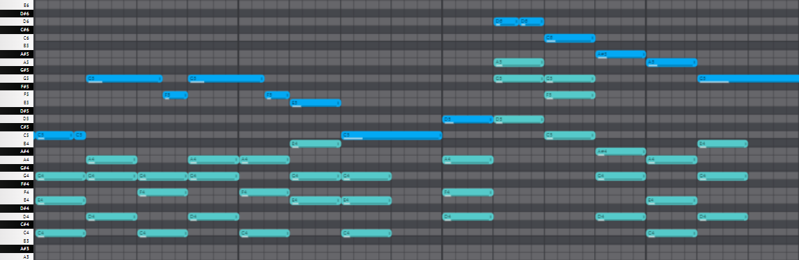
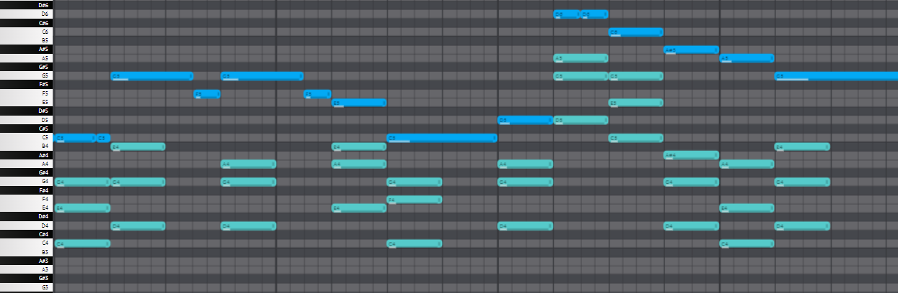

# Assignment report
Author: Vitaly Mahonin (v.mahonin@innopolis.university)

# Running manual

## brief
(Optional) Install progress bar dependency:
```
python3 -m pip install tqdm
```

Check the manual using `--help`:
```
usage: accompaniment [-h] [--out filename] [--iters int] [--ps float] [--cd float] [-k] input

Generate accompaniment for a melody

positional arguments:
  input           the input MIDI file

options:
  -h, --help      show this help message and exit
  --out filename  the output file name, default to "output"
  --iters int     number of iterations, default to 1000
  --ps float      pause sensitivity, default to 50
  --cd float      chord duration, default to 1
  -k              add detected key to the output file name (like filename-C#m.mid)
```

## tweaks

In most cases it's enough to use the default configuration:
```
./VitalyMahonin.py input3.mid
```


```
./VitalyMahonin.py input2.mid
```


### --ps


However, you may need it to fill the gaps:
```
./VitalyMahonin.py input3.mid --iters 10000 --ps 0
```


(Note that in most cases you also need to increase `--iters` because a proper gap fill can take a lot of resources)

Or otherwise, you need for it to play only in tact with the melody:
```
./VitalyMahonin.py input2.mid --ps 1000
```


### --cd

This parameter regulates the "width" of chords in the accompaniment:
```
./VitalyMahonin.py input2.mid --cd 2
```


### --iters

The bigger iterations you set, the more time program needs to complete, however, it is also more likely for it to generate better results.

Recommended to calculate the good iterations number using this formula:
`1000*(melody_length + 10*gap_length)/(32*chord_duration)`.

However, each melody is individual, so you may need a few more iterations to make it sound good, but sometimes a few less iterations will not affect the quality of the generated sound.