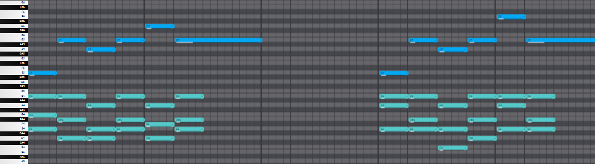
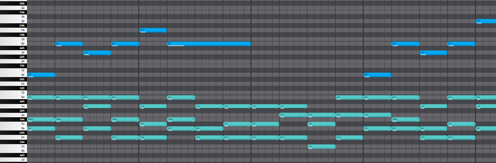
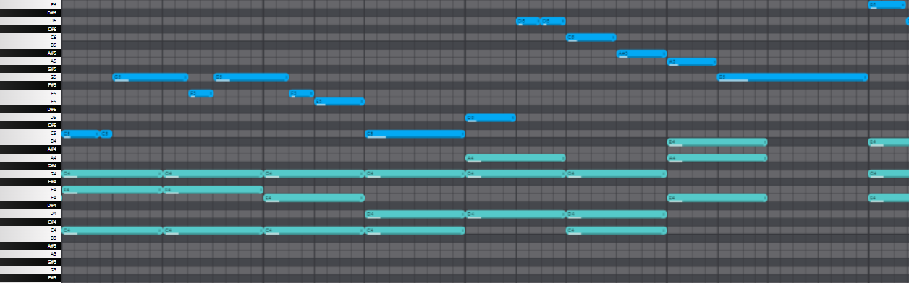

# Assignment report
Author: Vitaly Mahonin (v.mahonin@innopolis.university)

# Running manual

## brief
(Optional) Install progress bar dependency:
```
python3 -m pip install tqdm
```

Check the manual using `--help`:
```
usage: accompaniment [-h] [--out filename] [--iters int] [--ps float] [--cd float] [-k] input

Generate accompaniment for a melody

positional arguments:
  input           the input MIDI file

options:
  -h, --help      show this help message and exit
  --out filename  the output file name, default to "output"
  --iters int     number of iterations, default to 1000
  --ps float      pause sensitivity, default to 50
  --cd float      chord duration, default to 1
  -k              add detected key to the output file name (like filename-C#m.mid)
```

## tweaks

The default configuration output:
```
./VitalyMahonin.py input3.mid
```



### --ps


This parameter regulates the algorithm preference to use pauses:
```
./VitalyMahonin.py input3.mid --iters 10000 --ps 0
```



(Note that in most cases you also need to increase `--iters` because a proper gap fill can take a lot of resources, especially when melody has alternating octave)

### --cd

This parameter regulates the "width" of generated chords:
```
./VitalyMahonin.py input2.mid --cd 2
```




### --iters

The bigger iterations you set, the more time program needs to complete, however, it is also more likely for it to generate better results.
(Iterations are actually number of generations)

Recommended to calculate the good iterations number using this formula:
`1000*(melody_length + 10*gap_length)/(32*chord_duration)`.

However, each melody is individual, so you may need a few more iterations to make it sound good, but sometimes a few less iterations will not affect the quality of the generated sound.

Also you can stop program at any point by hitting ctrl+c, it will save the current result and terminate instantly.

# Algorithm flow

The melody is divided into equal pieces specified by `chord duration (--cd)`, each piece will contain one chord of accompaniment.

So a accompaniment is represented as a list of chords (list length is equal to the number of pieces).

To find a optimal list of chords the evolutionary algorithm is applied:

```python
melody_key = detect_key(melody)
fitness_function = create_fitness_function_from(melody, melody_key)
population = generate_100_random_instances()
for _ in range(generations_number):
  selected = select_best_50_instances_from(population, fitness_function)
  children = [mutate(cross(parents)) where parents = random.choice_two(selected) for _ in range(50)]
  population = selected + children
return the best instance of the latest population according to the fitness function
```

#### Closer description:
> **Select:**
> select the best 50 instances according to the fitness function

> **Cross:**
> the child's i-th chord is created by choosing i-th chord from a random parent.

> **Mutate:**
> for each chord it's 10% chance to be randomly modified.

> **Fitness function evaluation criterions:**
> +10 for each self-consonant chord
> +(3-29) for each chord that is consistent with the melody
> +(6-18) for each chord that matches the key
> +(18-20) for each chord that matches the octave of the previous chord
> +(2-6) for each chord that matches the average accompaniment octave
> +22 for each chord that matches melody octave
> +2 for each chord in correct chord progression
> +ps for each pause with the melody

# Key detection

## idea

Key is detected using [Krumhansl-Schmuckler algorithm](https://rnhart.net/articles/key-finding/) with simple profile coefficients from http://extras.humdrum.org/man/keycor/.

Briefly, the idea of the algorithm is to iterate all 24 possible keys and calculate it's correlation with the melody. Then, choose the best fit.

## detected keys
- input1.mid : Dm
- input2.mid : F
- input3.mid : Em